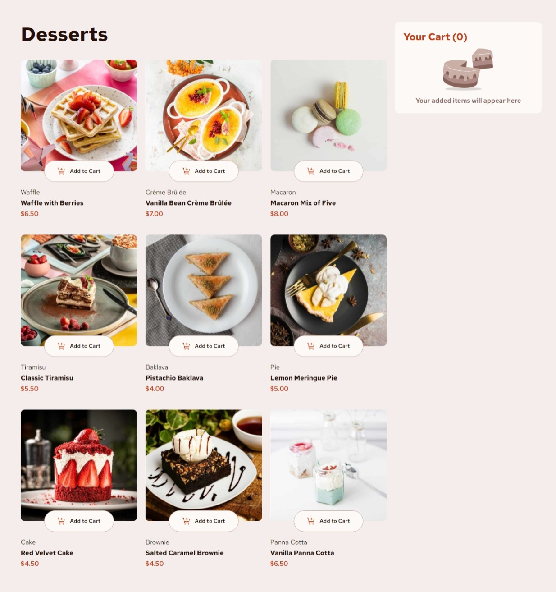
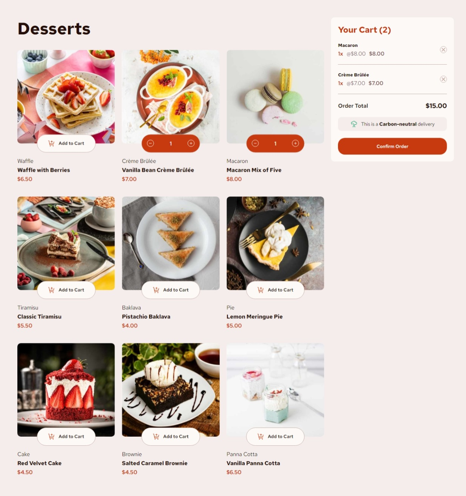
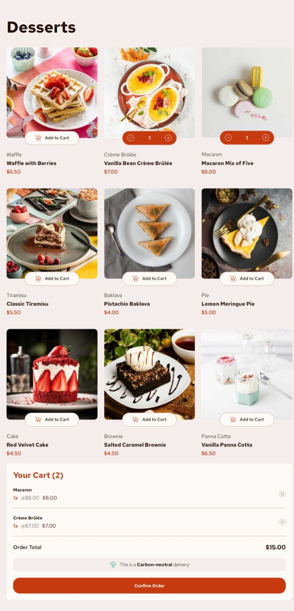
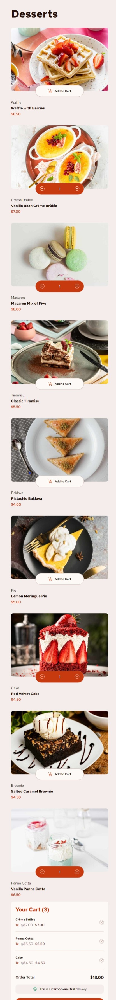

# Frontend Mentor - Product list with cart solution

This is a solution to the [Product list with cart challenge on Frontend Mentor](https://www.frontendmentor.io/challenges/product-list-with-cart-5MmqLVAp_d). Frontend Mentor challenges help you improve your coding skills by building realistic projects. 

## Table of contents

- [Overview](#overview)
  - [The challenge](#the-challenge)
  - [Screenshot](#screenshot)
  - [Links](#links)
- [My process](#my-process)
  - [Built with](#built-with)
  - [What I learned](#what-i-learned)
  - [Continued development](#continued-development)
  - [Useful resources](#useful-resources)
- [Author](#author)
- [Acknowledgments](#acknowledgments)

## Overview

### The challenge

Users should be able to:

- Add items to the cart and remove them
- Increase/decrease the number of items in the cart
- See an order confirmation modal when they click "Confirm Order"
- Reset their selections when they click "Start New Order"
- View the optimal layout for the interface depending on their device's screen size
- See hover and focus states for all interactive elements on the page

### Screenshot






### Links

- Solution URL: [Add solution URL here](https://your-solution-url.com)
- Live Site URL: [Add live site URL here](https://your-live-site-url.com)

## My process

### Built with

- Semantic HTML5 markup
- Flexbox
- CSS Grid
- Mobile-first workflow
- SCSS
- [React](https://reactjs.org/) - JS library

### What I learned

- This project has helped me to be more comfortable with Reat useState(), useEffect(), useRef() Hooks and Higher-order functions like the .map(), .filter(), .find().
- I also learn to add images dynamically from the src folder, without having to import them manually in my components using the requireContext().

```js
//Getting images dynamically from the (assets/images) folder
  const importAllImages = (requireContext) =>{
      let images = {};

      requireContext.keys().forEach((key)=>{
        const name = key.replace("./","").replace(/\.[^/.]+$/,"")
        images[name] = requireContext(key)
      })
      return images
  }

  const allImages = importAllImages(require.context("../../assets/images", false, /\.(jpg)$/))
  const screenSize = useScreenSize()
```
```jsx
//Passing the imagePaths to the <Card/> Components
  <div className="list-container">
    {
      shoppingList.map((product, index)=>{
        const imageKey = `image-${((product.name.normalize("NFD").replace(/[\u0300-\u036f]/g, "")).toLowerCase()).replace(" ","-")}-${screenSize}`
        const imageSrc = allImages[imageKey]

        return(
          <Card imageSrc={imageSrc} id={index} key={index} product={product} handleAddToCart={handleAddToCart}/>
        )
      })
    }
  </div>
```

### Continued development

I will like to extend this project further more with backends, where users have sign up as either buyer or seller, them make changes to the site by adding and removing products.
In future project, i will like focus more on horning my React Skills, and exploring more advance concepts like Routing, and will like to know more about class Components in React.

## Author

- Frontend Mentor - [@justicejatau](https://www.frontendmentor.io/profile/JusticeJatau)
- Github - [@justicejatau](https://github.com/JusticeJatau/)
- Facebook - [@justicejatau](https://web.facebook.com/jatau.justice)
